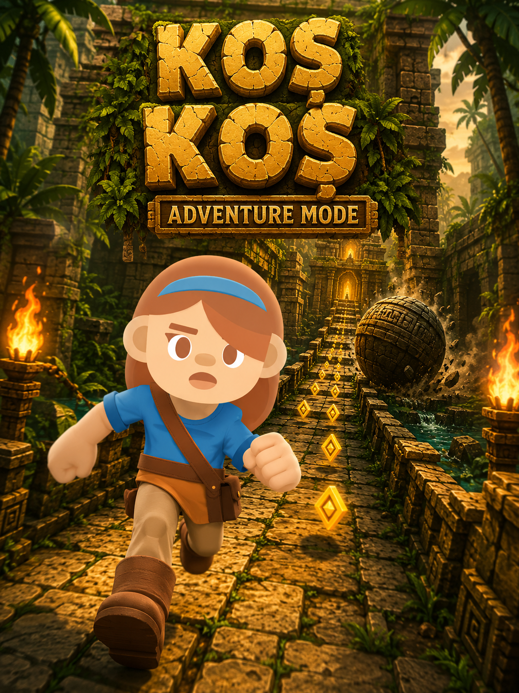
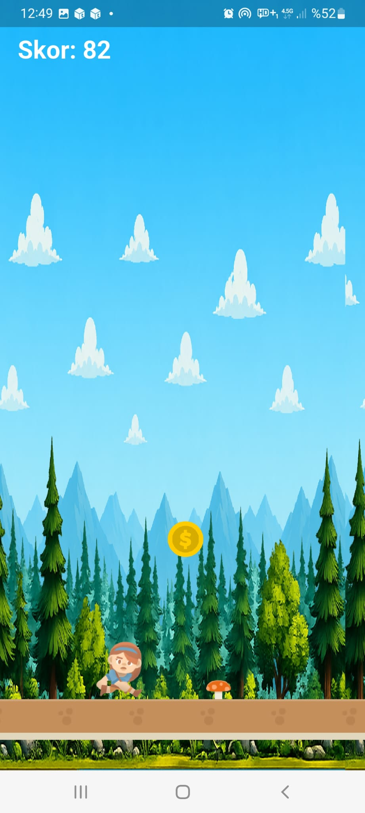
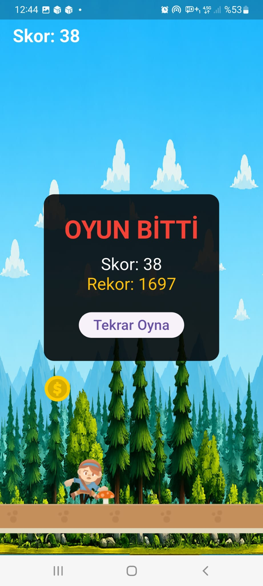

# 🏃‍♀️ KOŞ KOŞ

Flutter ve Flame oyun motoru ile geliştirilmiş, Android platformunda çalışan sonsuz koşu (endless runner) mobil oyunu.

> Bu proje, 10 günlük staj süreci kapsamında sıfırdan geliştirilmiştir.

---

## 📖 Proje Hakkında

KOŞ ESMA, oyuncunun sürekli ilerleyen bir karakteri yöneterek engellerden kaçtığı ve altın topladığı bir mobil oyundur. Karakter otomatik olarak koşar; oyuncu ekrana dokunarak zıplar. Oyun ilerledikçe hız artar, zorluk yükselir. Amaç mümkün olduğunca uzun süre hayatta kalarak en yüksek skoru elde etmektir.

## ✨ Özellikler

- 🏃 Üç kareli sprite animasyonu ile koşan karakter
- 🦘 Yerçekimi tabanlı fizik ve dokunmatik zıplama kontrolü
- 🍄 Rastgele aralıklarla üretilen mantar engelleri
- 🪙 Zıplayarak toplanabilen ve bonus puan kazandıran altınlar
- 📈 Zamanla artan oyun hızı ile dinamik zorluk dengesi
- 🏆 Cihazda kalıcı olarak saklanan en yüksek skor kaydı
- 🔊 Zıplama, çarpışma ve altın toplama ses efektleri
- 🎬 Kayan arka plan ile derinlik hissi
- 🎮 Başlangıç ekranı ve oyun sonu (Game Over) ekranı
- 🎨 Özel uygulama ikonu

## 📸 Ekran Görüntüleri

| Başlangıç | Oyun İçi | Oyun Sonu |
|-----------|----------|-----------|
|  |  |  |

## 🛠️ Kullanılan Teknolojiler

| Teknoloji | Kullanım Amacı |
|-----------|----------------|
| **Dart** | Programlama dili |
| **Flutter** | Mobil uygulama çatısı |
| **Flame 1.32** | Oyun motoru (oyun döngüsü, bileşenler, çarpışma) |
| **flame_audio** | Ses efektleri yönetimi |
| **shared_preferences** | En yüksek skorun kalıcı saklanması |
| **flutter_launcher_icons** | Uygulama ikonu üretimi |

## 🎯 Oyun Mekanikleri

**Oyun Döngüsü:** Flame'in `FlameGame` sınıfı üzerinden saniyede yaklaşık 60 kez çalışan `update()` ve `render()` döngüsü kullanılır. Tüm hareketler delta time (`dt`) ile çarpılarak hesaplanır; böylece oyun her cihazda aynı hızda akar.

**Fizik:** Karaktere sabit bir yerçekimi ivmesi uygulanır. Ekrana dokunulduğunda dikey hıza negatif bir değer atanarak zıplama gerçekleşir; yerçekimi karakteri kademeli olarak zemine geri çeker.

**Çarpışma Algılama:** `HasCollisionDetection` ve `CollisionCallbacks` yapıları ile hitbox tabanlı çarpışma kontrolü yapılır. Adil bir oyun deneyimi için hitbox boyutları görsellerin gövdesine göre küçültülmüştür.

**Nesne Yönetimi:** Engeller ve altınlar ekranın sağ dışında üretilir, oyun hızıyla sola akar ve ekranın solundan çıktıklarında `removeFromParent()` ile bellekten temizlenir.

## 📁 Proje Yapısı

```
runner_game/
├── lib/
│   └── main.dart          # Oyun kodu (bileşenler, ekranlar, mantık)
├── assets/
│   ├── images/            # Karakter, engel, altın, arka plan görselleri
│   ├── audio/             # Ses efektleri (jump, hit, coin)
│   └── icon/              # Uygulama ikonu
└── pubspec.yaml           # Bağımlılıklar ve varlık tanımları
```

### Ana Bileşenler

| Sınıf | Görevi |
|-------|--------|
| `RunnerGame` | Ana oyun sınıfı; döngü, skor, hız ve spawn yönetimi |
| `Player` | Oyuncu karakteri; animasyon, fizik, çarpışma tepkileri |
| `Ground` | Sonsuz döngüyle akan zemin |
| `ArkaPlan` | Kayan arka plan katmanı |
| `Mantar` | Çarpıldığında oyunu bitiren engel |
| `Coin` | Toplandığında puan kazandıran ödül |
| `BaslatEkrani` | Başlangıç ekranı (overlay) |
| `GameOverEkrani` | Oyun sonu ekranı (overlay) |

## 🎮 Nasıl Oynanır

1. Başlangıç ekranındaki **BAŞLAT** butonuna dokunun
2. Ekrana dokunarak zıplayın
3. Mantarlardan kaçının, altınları toplayın
4. Mantara çarptığınızda oyun biter; **Tekrar Oyna** ile yeniden başlayın

## 🎨 Görsel ve Ses Kaynakları

Projede kullanılan tüm görsel ve ses varlıkları ücretsiz ve ticari kullanıma açık kaynaklardan temin edilmiştir:

- **Karakter, engel ve zemin görselleri:** [Kenney.nl](https://kenney.nl) — CC0 lisansı
- **Ses efektleri:** Telifsiz ses kütüphaneleri
- **Arka plan ve tanıtım görselleri:** Proje için özel olarak üretilmiştir

## 📌 Geliştirme Süreci

Proje 10 günlük bir plan dahilinde aşamalı olarak geliştirilmiştir:

| Aşama | Kapsam |
|-------|--------|
| Gün 1–2 | Geliştirme ortamı kurulumu, Dart ve Flutter temelleri |
| Gün 3–5 | Flame motoru, oyuncu fiziği, animasyon, kayan dünya |
| Gün 6–8 | Engeller, çarpışma, skor sistemi, sesler, altın toplama |
| Gün 9–10 | Denge ayarları, arayüz ekranları, test ve yayına hazırlık |

## 📄 Lisans

Bu proje eğitim amaçlı geliştirilmiştir.

